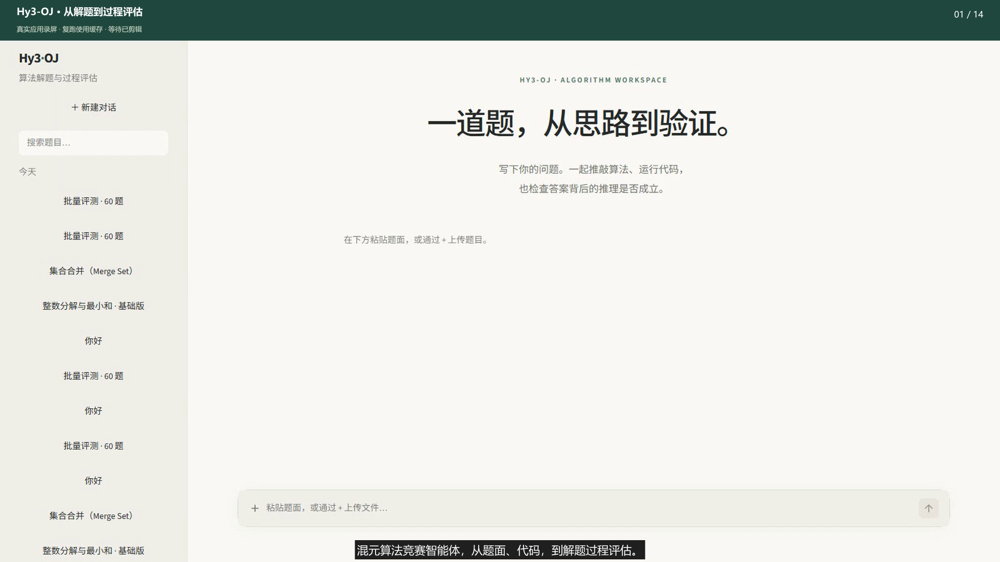
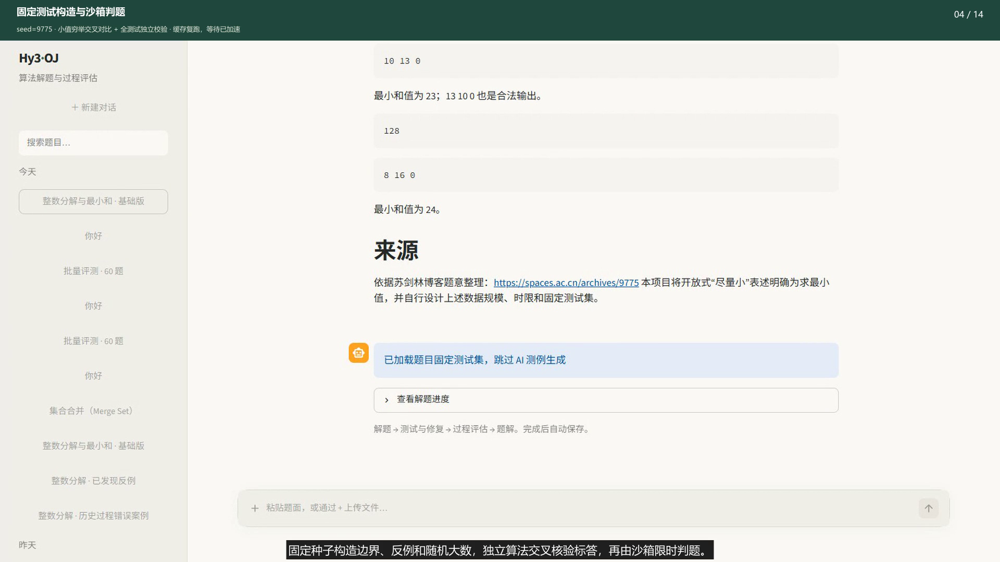
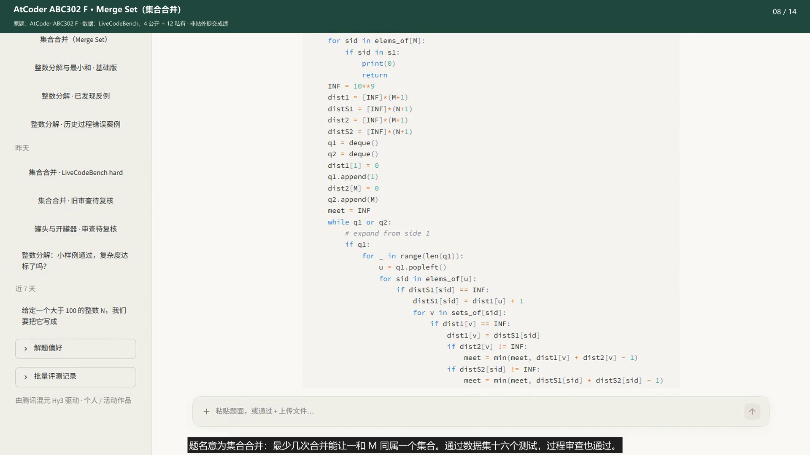

# Demo 视频、题源与交付文件

成片为 **1 分 58 秒，1080p / 30 fps**，包含烧录中文字幕和中文旁白。
从[分片交付目录](../runs/releases/demo/README.md)下载全部分片并还原即可播放。
字幕另存为 [SRT](assets/demo/Hy3-OJ-demo.zh-CN.srt)。



## 两类题目从哪里来

“外部题”是用户自行提供的题目；“内部题”是经项目数据加载器接入的评测题库，并非本项目原创题库。
内部评测已接入 **CodeContests**（`deepmind/code_contests`）和 **LiveCodeBench**（`livecodebench/code_generation_lite`）。
本视频正向展示一条外部题和一条 LiveCodeBench 题，批量看板使用既有 LiveCodeBench 60 题记录。

| 示例 | 题源 / 名称 | 演示使用的数据 | 判题结果 / 过程状态 |
|---|---|---|---|
| 外部题 | 苏剑林博客“自然数集中 N = ab + c 时 a + b + c 的最小值”；项目题面名“整数分解与最小和 · 基础版” | 本项目构造的 4 个公开 + 71 个私有测试，N≤10¹²，1 秒 / 256 MB | C++17，75/75，通过 / 通过 |
| 内部题 | AtCoder ABC302 F — **Merge Set（集合合并）**，`atcoder:abc302_f`；经 LiveCodeBench 接入 | 所用 LiveCodeBench 子集保存的 4 个公开 + 12 个私有测试，3 秒 / 1024 MB | Python3，16/16，通过 / 通过 |

外部题源见[苏剑林原文](https://spaces.ac.cn/archives/9775)。题包把“尽量小”明确为求精确最小和值；输入输出约定、资源限制和测试由项目补充，属于本项目数据，不是博客官方 OJ 测试。

内部题原题见 [AtCoder ABC302 F](https://atcoder.jp/contests/abc302/tasks/abc302_f?lang=en)。
**Merge Set** 的名字来自题目操作：合并有交集的集合，让元素 1 和 M 出现在同一个集合中，求最少合并次数。
视频中的 hard 是所用 LiveCodeBench 子集的难度标签。16/16 是本地 Docker 对这些数据的判定，不是提交 AtCoder 后得到的成绩。

## 外部测试怎么造

生成入口：[make_integer_decomposition_demo.py](../scripts/make_integer_decomposition_demo.py)，固定随机种子 **9775**。

1. 覆盖小整数与明确反例（如 128、130）、完全平方数及相邻值、相邻整数乘积、奇偶分支、上界及随机大数。
2. 在 101～20000 上用完整平方根枚举与四次根实现逐一交叉核验；全部固定测试再由独立奇偶参数化算法检查最小和值。
3. 大数据版另含超过 2⁵³ 的浮点精度测试，以及在线解法的窗口反例；范围扩大为 N≤2⁶³−1，共 90 点，时限同为 **1 秒**、内存同为 **256 MB**。
4. 注册的特殊校验器检查非负整数、N=ab+c 与最小和值，接受任意最优三元组；完整题包跳过 AI 测例生成。

详情与复验命令见[固定测试数据说明](integer_decomposition_dataset.md)。
视频成功片段使用基础版；AI 造测、自纠错和复杂度错误审查用已标注的历史片段展示。
大数据版的参考解通过记录与在线模型的反例都保留，未把参考解成绩当作在线 Agent 成绩。

## 功能与视频标注

视频依次展示输入澄清、文件上传、语言选择、自动解题、Docker 判题、代码与公式题解、五段过程审查、AI 造测与修复、结果与过程的独立状态、人工反馈、历史搜索与刷新恢复、批量难度分层与逐题详情。
题源、造测方法、两个内部数据集、演示题所属数据集及名称含义均已加入字幕或章节说明。
缓存复跑、等待加速、历史回放均在相应镜头标注。





## GitHub 上传与文件完整性

视频、完整题包和验收证据放入 ZIP，切为 **每片最多 8 MiB** 的分片。必须把所有分片和 manifest 一起提交。
GitHub 浏览器上传单文件上限为 25 MiB，普通 Git 对超过 50 MiB 的文件警告、超过 100 MiB 的文件阻止推送；本交付采用更小的分片预算。[GitHub 文件限制](https://docs.github.com/en/repositories/working-with-files/managing-large-files/about-large-files-on-github)

```powershell
python scripts/split_archive.py restore runs/releases/demo/manifest.json runs/demo_restored
python scripts/audit_release.py
```

还原器会核对每个分片、完整 ZIP 和每个解压文件的 SHA-256；缺片或损坏时失败。还原目录须为空或不存在。
图片保存在正常入库的 `docs/assets/demo/`，Markdown 使用相对路径。
所有层级的运行缓存默认忽略，仅精确放行 `runs/releases/demo/` 的交付分片、清单与说明。
原始录屏、临时剪辑、模型缓存、系统字体和工具安装目录继续保留在本地运行目录。

上传前检查器检查 **已跟踪 + 未忽略的新文件**，验证 Markdown/HTML 的本地图片及链接是否存在、大小写是否与 Git 路径一致、目标是否被忽略；同时检查单文件大小和可达 Git 历史中的大文件。
仓库的 CI 重复执行该检查及分片完整性校验。报告输出到 `runs/release_audit/report.json`。
检查通过表示这份候选文件集合完整；提交时仍需包含新增文件，CI 会按实际提交重新检查。

运行日志中以代码形式列出的路径属于运行时复现产物，按对应脚本生成；全量评测数据仍由加载器准备。交付包已额外带上本次演示的完整单题数据，无须下载两个全量数据集。
