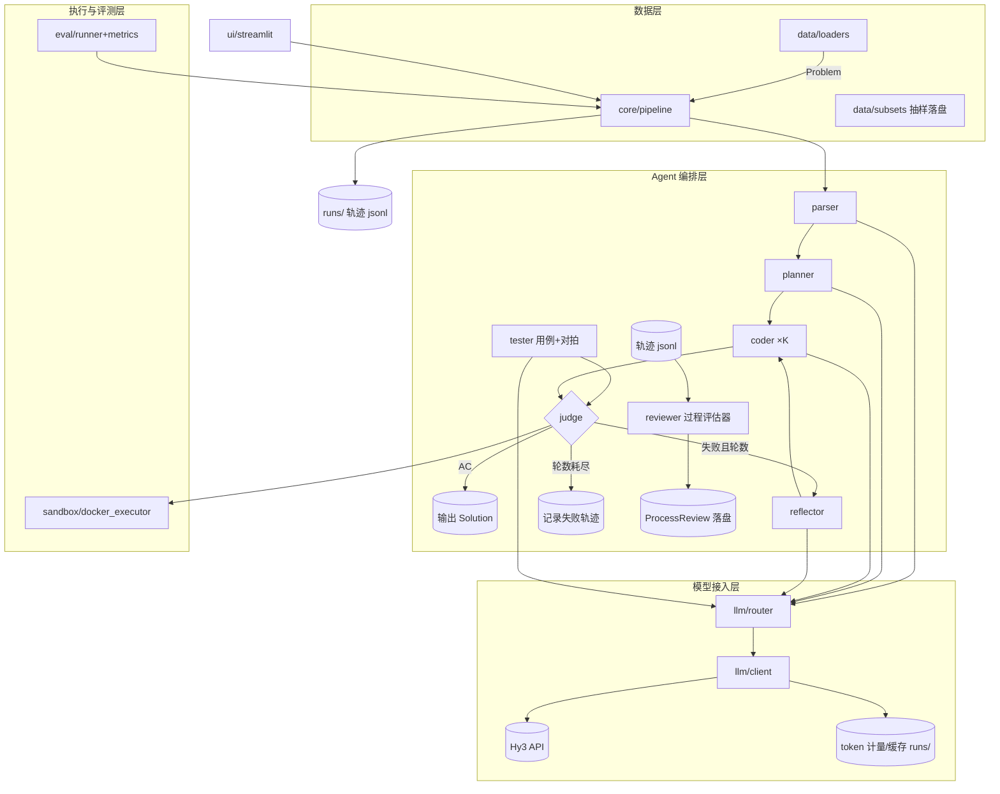

# Hy3-OJ 项目架构设计

> 配套文档：《混元大语言模型-场景二算法竞赛方向-方案设计.md》（总体方向：背景目标、设计思路、重点技术、预期效果、时间规划）。
> 本文档负责工程落地：folder 级模块总览 → 各模块作用 → 模块间交互关系 → 算法思路 → 参考文献与代码库。

---

## 一、总体模块设计（Folder 视图）

```
hy/
├── configs/                     # 运行配置（yaml）：模型端点、采样参数、沙箱限额、评测子集
│   └── default.yaml
├── hy3_oj/                      # 主包
│   ├── core/                    # 编排内核：数据契约 + 状态机 + 配置
│   │   ├── schemas.py           #   Problem/Plan/Solution/TestCase/JudgeResult/Reflection（pydantic）
│   │   ├── pipeline.py          #   解题闭环状态机（Parser→Planner→Coder→Judge⇄Reflector）
│   │   └── config.py            #   yaml 加载 + 环境变量合并（API key 不落盘）
│   ├── llm/                     # 模型接入层：对上层屏蔽 Hy3 API 细节
│   │   ├── client.py            #   OpenAI 兼容客户端：重试/限流/token 计量/磁盘缓存
│   │   ├── router.py            #   快/慢思考模式调度（按难度标签、失败轮数、预算）
│   │   └── pricing.py           #   token 成本统计与帕累托数据落盘
│   ├── agents/                  # Agent 编排层：六个职责单一的智能体
│   │   ├── parser.py            #   题意结构化 + 算法标签预测
│   │   ├── planner.py           #   慢思考产出结构化解题计划
│   │   ├── coder.py             #   快思考 K 路采样生成代码
│   │   ├── tester.py            #   边界测试用例生成 + 暴力对拍
│   │   ├── reflector.py         #   CE/RE/WA/TLE 归因与定向修复指令
│   │   └── reviewer.py          #   过程评估器：分步审查/错误定位/类型归类/蒙对检测
│   ├── sandbox/                 # 执行与判题层
│   │   ├── docker_executor.py   #   Docker SDK 一次性容器：编译/运行/限时/限内存/网络隔离
│   │   ├── judge.py             #   verdict 解析：AC/WA/TLE/RE/CE + 输出比对（含浮点容差）
│   │   └── cube_adapter.py      #   CubeSandbox 适配接口（与 docker_executor 同协议，可热替换）
│   ├── data/                    # 数据层
│   │   ├── loaders/
│   │   │   ├── codecontests.py  #   HF deepmind/code_contests → 统一 Problem schema（优先）
│   │   │   └── livecodebench.py #   LCB code_generation_lite → Problem schema（后置）
│   │   ├── subset.py            #   难度分层抽样 200~400 题，落盘可复现（固定 seed）
│   │   └── cache.py             #   parquet/jsonl 本地缓存
│   ├── eval/                    # 评测层
│   │   ├── runner.py            #   批量评测驱动（asyncio 并发：采样 × 判题双管道）
│   │   ├── metrics.py           #   无偏 pass@k（组合估计）、难度分桶、收敛轮数统计
│   │   ├── process_eval.py      #   过程评估器验证：bug 注入 ground truth → 定位准确率；人工抽检 → 误报率
│   │   └── report.py            #   消融表格 / 成本-效果帕累托曲线 / 错误类型分布 / 失败案例导出
│   ├── prompts/                 # 提示资产：agent × 错误类型的模板（yaml），版本化管理
│   │   ├── parser.yaml / planner.yaml / coder.yaml / tester.yaml / reviewer.yaml
│   │   └── repair/              #   ce.yaml re.yaml wa.yaml tle.yaml（定向修复模板）
│   └── ui/                      # 交互层（后置）
│       └── streamlit_app.py     #   题目提交 → 解题轨迹可视化 → 榜单
├── scripts/                     # 入口脚本
│   ├── run_baseline.py          #   单轮直出基线
│   ├── run_solve.py             #   单题闭环解题（调试用，打印完整轨迹）
│   └── run_eval.py              #   子集评测 + 报告生成
├── tests/                       # pytest：schema 单测、沙箱冒烟、judge 对拍用例
├── runs/                        # 运行产物（gitignore）：轨迹 jsonl、token 计量、评测结果
└── requirements.txt / environment.yml
```

---

## 二、各模块作用

### 2.1 `core/` —— 编排内核

| 文件 | 职责 | 关键设计 |
|---|---|---|
| `schemas.py` | 全系统唯一数据契约 | 所有模块间只传 pydantic 模型，杜绝字符串拼接口；字段含版本号便于轨迹回放 |
| `pipeline.py` | 解题闭环状态机 | 显式状态转移（见 §3.2），每步落盘；最大修复轮数 N、预算上限均可配 |
| `config.py` | 配置中枢 | yaml + 环境变量双层覆盖；API key 只走环境变量 |

核心数据模型（字段示意）：

| 模型 | 关键字段 |
|---|---|
| `Problem` | id, source(codecontests/lcb), statement, constraints, samples[], difficulty, tags[], public/private/generated_tests |
| `Plan` | algorithm_tags, approach(bulleted 步骤), complexity(time/space), edge_cases[], pseudocode? |
| `Solution` | code, language(py3；预留 cpp17), plan_ref, sample_seed(temperature), gen_mode(fast/slow) |
| `TestCase` | input, expected_output?, is_ai_generated, validator_ref |
| `JudgeResult` | verdict(AC/WA/TLE/RE/CE), failed_test?, stderr, time_ms, memory_kb, diff_excerpt |
| `Reflection` | cause_class, diagnosis, fix_instruction, counter_example?(WA 时), round_idx |
| `ProcessReview` | step_verdicts[5]（每段 pass/fail + 证据引用）, error_step?, error_type?, lucky_pass_flags[], process_score |

### 2.2 `llm/` —— 模型接入层

| 文件 | 职责 | 关键设计 |
|---|---|---|
| `client.py` | Hy3 API 唯一出口 | OpenAI 兼容协议；tenacity 指数退避重试；信号量限流；diskcache 按 (prompt, mode, seed) 缓存省 token；每次调用计量落盘 |
| `router.py` | 快/慢思考调度 | 策略接口 `route(stage, difficulty, fail_rounds, budget) -> mode`；默认规则：规划/归因→慢，生成/改写→快；难度升级或连续失败时升格慢思考 |
| `pricing.py` | 成本分析 | 按题/阶段聚合 token 与耗时，供帕累托曲线 |

> Hy3 快/慢思考的具体 API 参数名在 D1 实测后写入 `configs/default.yaml`，代码只读配置，不改逻辑。

### 2.3 `agents/` —— 五个智能体

| Agent | 输入 → 输出 | 思考模式 | 算法/策略要点 |
|---|---|---|---|
| `parser` | 原始题面 → `Problem` + tags | 快 | 长题面一次读入（256K 上下文）；标签集合对齐 CodeContests 官方 tag 体系，供路由与检索 |
| `planner` | `Problem` → `Plan` | 慢 | 要求输出：算法选型理由、复杂度证明、边界清单；可选挂载「相似题 exemplar」（MapCoder 式检索增强，见 §4.2） |
| `coder` | `Plan` → `Solution`×K | 快 | K=4~8 温度分层采样；统一 I/O 模板；AlphaCodium 式两阶段：先要点化解法再写码 |
| `tester` | `Problem`(+`Plan`) → `TestCase`[] + brute-force 参考解 | 快+慢 | 边界用例生成；对简单题生成暴力解做差分对拍；用例先经 validator（自校验脚本）过滤非法输入（CodeContests+ 思路） |
| `reflector` | `JudgeResult` + 轨迹 → `Reflection` | 慢 | 按 verdict 分流：CE→编译错误定位；RE→栈信息归因；WA→**先构造反例再修复**；TLE→复杂度重分析、要求换更优算法而非微调 |
| `reviewer` | 完整轨迹（Problem+Plan+Solution+JudgeResult+Reflection）→ `ProcessReview` | 慢 | **五段式分步审查**：①题意理解 ②算法选型 ③复杂度论证 ④边界处理 ⑤实现一致性；规则校验（蒙对检测）+ 分步 LLM 审查混合；对 AC 与失败样本都运行 |

### 2.4 `sandbox/` —— 执行与判题

| 文件 | 职责 | 关键设计 |
|---|---|---|
| `docker_executor.py` | 容器内执行 | 镜像 `python:3.11-slim`（C++17 阶段加 `gcc` 镜像）；挂载代码只读；`nano_cpus`/`mem_limit`/网络 `none`；超时强杀；容器池并发上限可配；Windows 路径 `resolve()` 后统一映射容器 POSIX 路径 |
| `judge.py` | 判题 | 逐测试点比对：trim 后精确比较 + 浮点容差档；exit code/超时/编译失败 → CE/RE/TLE 分类；返回首个失败点摘要（供 reflector） |
| `cube_adapter.py` | 迁移接口 | 与 executor 同一 `execute(solution, tests) -> JudgeResult` 协议， CubeSandbox（E2B 兼容 SDK）实现后置接入 |

### 2.5 `data/` / `eval/` / `prompts/` / `ui/`

- `data/loaders/codecontests.py`：读 HF `deepmind/code_contests`，字段映射到 `Problem`（description→statement、public/private/generated_tests 直接可用，本地判题可控）；`subset.py` 按 difficulty 分层 + 固定 seed 抽样 200~400 题落 `data/subsets/`。
- `eval/metrics.py`：**无偏 pass@k** 估计 \(1-\binom{n-c}{k}/\binom{n}{k}\)（n 采样数、c 通过数）；按难度分桶；平均收敛轮数；`report.py` 输出消融表与帕累托数据。
- `prompts/`：模板与代码分离，消融实验只换模板版本号，保证可复现。
- `ui/streamlit_app.py`：后置；读取 `runs/` 轨迹回放，不做重计算。

---

## 三、模块间交互关系

### 3.1 数据流总览



### 3.2 闭环状态机（pipeline.py）

```
PARSED ──plan──▶ PLANNED ──gen(K)──▶ GENERATED ──local_tests──▶ LOCAL_TESTED
   ▲                                                                │
   │                                          全过 ──submit──▶ JUDGED(AC→DONE)
   │                                                                │ 失败
   └──refine(重规划,仅当连续失败≥2) ◀── REFLECTED ◀──reflect───────┘
                                          │ fix
                                          ▼
                                       PATCHED ──local_tests──▶ …（轮数+1）
```

- 状态持久化：每次转移向 `runs/<problem_id>.jsonl` 追加事件，支持断点续跑与轨迹回放（Demo 直接复用）。
- 退出条件：AC / 修复轮数达 N / token 预算耗尽（三通道均落盘原因）。

### 3.3 关键交互约定

1. **Agent 之间不直接通信**：全部经由 `core/schemas` 模型，由 pipeline 转发 —— 保证任一 Agent 可独立单测、编排层可整体替换（自研 asyncio ↔ tRPC-Agent）。
2. **判题预筛两级**：先样例 + AI 用例本地筛（便宜），再全量 private/generated 测试判（贵），无效提交在本地被拦截。
3. **llm 层对 Agent 透明**：Agent 只声明 `stage` 与偏好，`router` 决定快/慢，便于做调度策略消融。

---

## 四、算法思路

### 4.1 主闭环（Generate-and-Test + Reflexion）

1. Parser 结构化题面并预测算法标签；2. Planner 慢思考产出要点化 `Plan`；3. Coder 以温度分层采样 K 份代码；4. Tester 生成边界用例与暴力参考解，K 份候选在「样例 + AI 用例 + 对拍」上筛选；5. 幸存者进入全量判题；6. 失败时 Reflector 按 verdict 四类归因并产出修复指令（WA 强制先给反例）；7. 回到 4，至多 N 轮；8. 多份幸存解并存时，以「生成测试上的程序行为聚类」选代表解（AlphaCode2 式 k→1）。

### 4.2 过程评估（Reviewer，任务书核心）

**输入**：完整解题轨迹（Problem → Plan → Solution×K → JudgeResult → Reflection，jsonl 回放）。

**五段式分步审查**（每段独立判定 pass/fail 并引用证据，错误步骤定位 = 首个 fail 段）：

| 步骤段 | 审查内容 | 典型过程错误 |
|---|---|---|
| ①题意理解 | Plan 对约束/输入输出的复述是否与题面一致 | 题意误读、条件遗漏 |
| ②算法选型 | 所选算法范式是否适配数据范围与问题结构 | 算法选型错误、概念理解错误 |
| ③复杂度论证 | 声称复杂度是否推导成立、是否满足约束上界 | 复杂度误判、跳步推导 |
| ④边界处理 | 边界清单是否覆盖 n=0/1、极值、重复元素等 | 边界遗漏 |
| ⑤实现一致性 | 代码是否忠实实现 Plan（变量含义、循环边界、取模等） | 实现逻辑错误、格式不符、幻觉（编造不存在的库函数） |

**蒙对检测（AC 但过程不成立）规则集**（规则先行，LLM 复核）：
1. 硬编码样例：代码中出现样例输入/输出的字面量；
2. 输入特判：对特定 n/特定值做分支返回（`if n == 5: print(...)`）；
3. 声称-实现不符：Plan 声称 O(n log n) 但实现为 O(n²) 暴力，仅靠小数据侥幸通过；
4. 大数溢出/精度巧合：Python 大整数掩盖的溢出在 C++ 语义下不成立（多语言阶段启用）。

**双层错误分类体系**：结果层 CE/RE/WA/TLE（judge 自动产出）× 过程层七类（上表）。报告按两维交叉统计。

### 4.3 过程评估器有效性验证（eval/process_eval.py）

- **定位准确率**：取官方参考解（CodeContests solutions 字段），用规则 + LLM 自动注入已知 bug（改边界、换错算法、删取模…），记录注入位置为 ground truth；Reviewer 预测 error_step 与注入段比对，统计段级命中率，目标 ≥70%。
- **误报率**：对官方正确参考解跑 Reviewer，被判"过程有问题"的样本人工抽检（~50 题），区分真实问题 vs 误报，目标误报率 ≤20%；抽检记录落盘（题号/判定/理由/抽检人）。

### 4.4 可插拔增效点（消融对象）

- **相似题检索增强**（MapCoder）：按标签 + 题面嵌入从已解题库检索 exemplar 注入 planner —— 检索库用评测子集外的题，防泄漏。
- **测试 validator**（CodeContests+）：AI 用例先跑自校验（满足输入约束）再入库，降低"错题判对解"噪声。
- **快慢思考调度**：`route()` 策略参数化，产出"推理深度–通过率–token 成本"帕累托前沿。
- **两阶段生成**（AlphaCodium）：要点化解法 → 代码，降低长链生成漂移。

### 4.5 评测方法

- 指标：pass@1（主）、无偏 pass@k、**过程正确率、错误类型分布、定位准确率、误报率**、难度分桶、平均收敛轮数、token/题。
- 基线：单轮直出（同模型同 prompt 预算），所有增益相对基线报告。
- 可复现：子集 seed、prompt 版本、容器镜像 tag、原始轨迹、人工抽检记录全部落盘。

---

## 五、参考文献与代码库

| 文献/仓库 | 借鉴点 | 链接 |
|---|---|---|
| AlphaCode (DeepMind, Science 2022) | 大规模采样 + 过滤 + 聚类选解；CodeContests 数据集 | `deepmind/code_contests` (HF) |
| AlphaCode2 (DeepMind, 2023) | Gemini + 行为聚类 k→1 选择策略 | tech report |
| AlphaCodium (CodiumAI, 2024) | 测试锚定的两阶段迭代流；预处理反思 + AI 测试递增修复；工程 best practices | github.com/Codium-ai/AlphaCodium |
| MapCoder (Microsoft, arXiv 2405.11403) | 多 Agent（检索/规划/编码/调试）模拟人类解题；相似题回忆 | arxiv.org/abs/2405.11403 |
| CodeContests+ (EMNLP 2025 Findings) | generator + validator 协同的高质量测试用例生成 Agent | arxiv.org/abs/2506.05817 |
| Reflexion (arXiv 2303.11366)；Self-Repair (arXiv 2305.07898) | 语言化反思轨迹；修复增益依赖测试反馈质量（→ 对拍模块的理论依据） | — |
| LiveCodeBench | 防污染滚动基准；`code_generation_lite` 数据集与官方 runner | livecodebench.github.io |
| CodeElo (arXiv 2501.01257) | Codeforces rating 估计方法论（报告加分项） | — |
| CubeSandbox（犀牛鸟兄弟项目） | 沙箱迁移目标，E2B 兼容、60ms 建沙箱 | 预留 `cube_adapter.py` |
| OpenAI 兼容 API 规范 | Hy3 接入协议 | `llm/client.py` |
